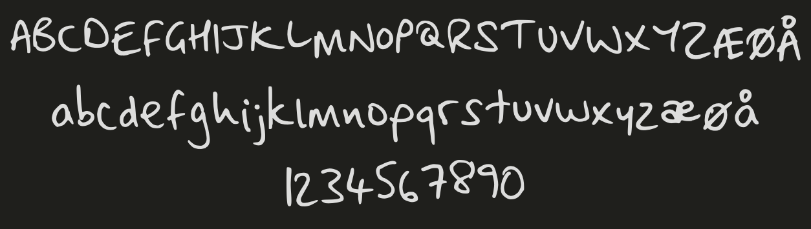

# aimeefont

my handwriting as a font

## How to use it

Add the following CSS stylesheet:

    <link rel="stylesheet" href="https://aimeerivers.github.io/aimeefont/web/stylesheet.css" type="text/css" charset="utf-8" />

Add `class="aimeefont"` to any element to use the font.

## How to download it

You will find OTF and TTF versions in the `dist` folder, which you can install on your computer.
